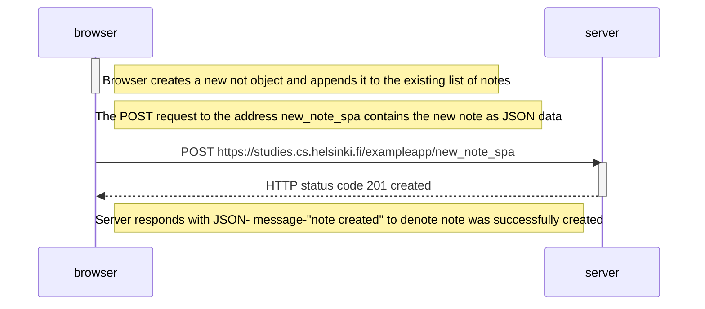

Use the live preview to view the diagram

```mermaid
sequenceDiagram
    participant browser
    participant server

    activate browser
    Note right of browser: Browser creates a new not object and appends it to the existing list of notes
    deactivate browser
    Note right of browser: The POST request to the address new_note_spa contains the new note as JSON data
    browser->>server: POST https://studies.cs.helsinki.fi/exampleapp/new_note_spa
    activate server
    server-->>browser: HTTP status code 201 created
    deactivate server
    Note right of browser: Server responds with JSON- message-"note created" to denote note was successfully created

```